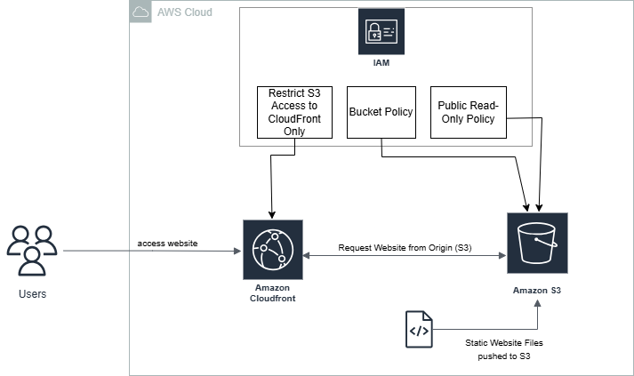

# Static Website Deployment on AWS

This project demonstrates how to host and deploy a static website on Amazon Web Services (AWS) using Amazon S3, Amazon CloudFront, and IAM. The repository includes the reference architecture diagram and the scripts used to set up the deployment.

---

## **Project Overview**

This project focuses on deploying a static website using AWS services to ensure scalability, global availability, and secure access control. The website consists of HTML, CSS, and JavaScript files stored in an S3 bucket and delivered worldwide through CloudFront’s content delivery network.

---

## **Architecture**

The architecture follows a simple but powerful design:

* **Amazon S3** is used as the main hosting service for the static website files.
* **Amazon CloudFront** serves as a global content delivery layer, reducing latency for users.
* **IAM** manages permissions and ensures secure access to AWS resources.

A reference architecture diagram is included in this repository for better visualization.



## **Services Used**

### **1. Amazon S3 – Static Website Hosting**

The website is hosted in an S3 bucket configured for static website hosting. The bucket stores all frontend assets such as:

* HTML files
* CSS stylesheets
* JavaScript files

S3 provides a highly scalable and cost-efficient hosting solution for static content.

---

### **2. Amazon CloudFront – Content Delivery Network (CDN)**

CloudFront is used to:

* Deliver website content with low latency
* Cache frequently accessed files at edge locations
* Improve global performance for users accessing the website

The S3 bucket is configured as the origin for the CloudFront distribution.

---

### **3. IAM – Access Management**

IAM ensures that only authorized resources can access or modify the S3 bucket or CloudFront distribution. Policies were implemented to allow public read access for web content and restrict access when needed.

Below are the IAM policies used in the project.

---

## **IAM Policies Used**

### **Bucket Policy – Allow Public Read Access**

```
{
  "Version": "2012-10-17",
  "Statement": [
    {
      "Effect": "Allow",
      "Principal": "*",
      "Action": "s3:GetObject",
      "Resource": "arn:aws:s3:::my-cafe-website-hosting123/*"
    }
  ]
}
```

### **Public Read-Only Policy for Static Website**

```
{
  "Version": "2012-10-17",
  "Statement": [
    {
      "Effect": "Allow",
      "Principal": "*",
      "Action": "s3:GetObject",
      "Resource": "arn:aws:s3:::my-cafe-website-hosting123/*"
    }
  ]
}
```

### **Restrict S3 Access to CloudFront Only**

```
{
  "Version": "2012-10-17",
  "Statement": [
    {
      "Effect": "Allow",
      "Principal": {
        "Service": "cloudfront.amazonaws.com"
      },
      "Action": "s3:GetObject",
      "Resource": "arn:aws:s3:::my-cafe-website-hosting123/*",
      "Condition": {
        "StringEquals": {
          "AWS:SourceArn": "arn:aws:cloudfront::123456789012:distribution/EDFDVBD6EXAMPLE"
        }
      }
    }
  ]
}
```

---

## **Repository Contents**

* Reference architecture diagram (PNG/JPEG)
* Deployment scripts
* IAM policy samples
* Website files (optional depending on your repo setup)

---

## **How to Deploy**

1. Create an S3 bucket and enable static website hosting.
2. Upload your website files.
3. Apply the public-read bucket policy or CloudFront-restricted policy.
4. Create a CloudFront distribution with the S3 bucket as the origin.

---

## **Conclusion**

This project demonstrates a complete static website deployment workflow using AWS S3, CloudFront, and IAM. The architecture ensures high availability, low latency, and secure access control.

Feel free to explore the repository and use the reference materials to deploy your own static website on AWS.

